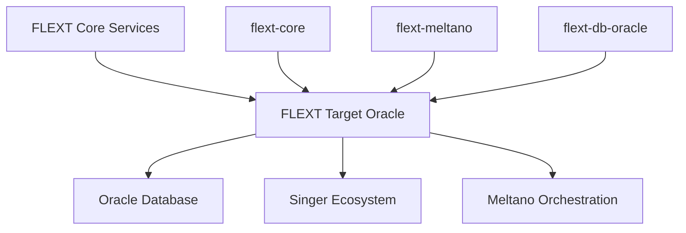
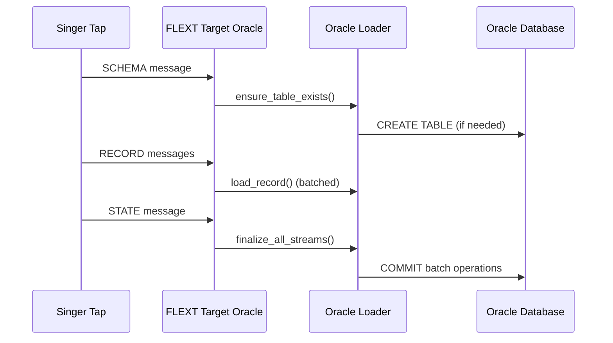
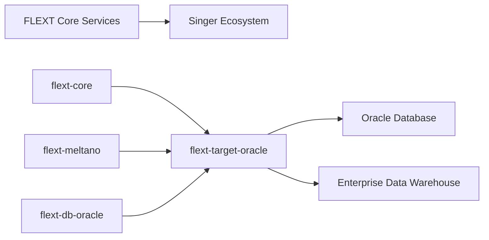

# FLEXT Target Oracle

**Type**: Singer Target | **Status**: 1.0.0 Release Preparation | **Dependencies**: Python 3.13+, flext-core, flext-db-oracle, flext-meltano, singer-sdk

Production-grade Singer target for Oracle Database data loading, built with FLEXT ecosystem patterns and reliability standards.

## Overview

FLEXT Target Oracle is a core component of the FLEXT data integration platform, providing high-performance, reliable data loading capabilities for Oracle databases. The target implements the Singer specification for standardized data integration workflows while leveraging FLEXT's foundational patterns for reliability.

### Position in FLEXT Ecosystem



### Key Capabilities

- **Enterprise Oracle Integration**: Support for Oracle 11g through 23c with advanced features
- **Singer Protocol Compliance**: Full Singer SDK implementation with stream processing
- **FLEXT Pattern Integration**: Built on flext-core foundations with FlextResult patterns
- **High-Performance Loading**: Optimized batch processing and bulk operations
- **Production-Ready Architecture**: Clean Architecture + DDD with quality gates
- **Zero-Tolerance Quality**: 90%+ test coverage with strict quality enforcement

### Core Dependencies

- **[flext-core](https://github.com/organization/flext/tree/main/flext-core/)**: Foundational patterns (FlextResult, FlextModels.Value, logging)
- **[flext-meltano](https://github.com/organization/flext/tree/main/flext-meltano/)**: Singer SDK integration and Target base classes
- **[flext-db-oracle](https://github.com/organization/flext/tree/main/flext-db-oracle/)**: Oracle database operations and connectivity
- **[Singer SDK](https://sdk.meltano.com/)**: Data integration protocol implementation

## 🏗️ Architecture

### Clean Architecture Implementation

```
src/flext_target_oracle/
├── __init__.py          # Public API and exports
├── config.py            # Configuration (FlextModels.Value patterns)
├── target.py            # Singer Target implementation
├── loader.py            # Oracle data loading operations
└── exceptions.py        # Domain-specific error handling
```

### FLEXT Integration Patterns

- ✅ **FlextResult Railway Pattern**: Consistent error handling throughout
- ✅ **FlextModels.Value Configuration**: Type-safe, validated configuration
- ✅ **flext-core Logging**: Structured logging with correlation IDs
- ✅ **flext-db-oracle Integration**: Production-grade Oracle connectivity
- ✅ **flext-meltano Base Classes**: Singer SDK integration layer
- ✅ **Domain-Driven Design**: Clear separation of concerns and responsibilities

### Data Flow Architecture



## 🚀 Quick Start

### Installation

```bash
# Install from local development
pip install -e .

# Or install from PyPI (when published)
pip install flext-target-oracle
```

### Basic Configuration

```python
from flext_target_oracle import FlextOracleTarget, FlextOracleTargetSettings, LoadMethod

# Create configuration using FLEXT patterns
config = FlextOracleTargetSettings(
    oracle_host="localhost",
    oracle_port=1521,
    oracle_service="XE",
    oracle_user="singer_user",
    oracle_password="password",
    default_target_schema="SINGER_DATA",
    load_method=LoadMethod.BULK_INSERT,
    batch_size=1000,
    use_bulk_operations=True
)

# Initialize target
target = FlextOracleTarget(config)
```

### Singer Message Processing

```python
from flext_target_oracle import FlextOracleTarget

def process_data():
    # Schema message
    schema_msg = {
        "type": "SCHEMA",
        "stream": "users",
        "schema": {
            "type": "object",
            "properties": {
                "id": {"type": "integer"},
                "name": {"type": "string"},
                "email": {"type": "string"}
            }
        }
    }

    # Record messages
    record_msg = {
        "type": "RECORD",
        "stream": "users",
        "record": {"id": 1, "name": "John Doe", "email": "john@example.com"}
    }

    # Process with FlextResult pattern
    schema_result = target.process_singer_message(schema_msg)
    if schema_result.is_failure:
        print(f"Schema processing failed: {schema_result.error}")
        return

    record_result = target.process_singer_message(record_msg)
    if record_result.is_failure:
        print(f"Record processing failed: {record_result.error}")
        return

    # Finalize and get statistics
    stats_result = target.finalize()
    if stats_result.success:
        print(f"Processed {stats_result.data['total_records']} records")

# Run processing
run(process_data())
```

### Meltano Integration

```yaml
# meltano.yml
targets:
  - name: target-oracle
    namespace: flext_target_oracle
    pip_url: flext-target-oracle
    settings:
      - name: oracle_host
      - name: oracle_port
      - name: oracle_service
      - name: oracle_user
      - name: oracle_password
        kind: password
      - name: default_target_schema
      - name: batch_size
        kind: integer
```

## 📊 Current Status & Documentation

**Current Status**: Version 0.9.9 - **Comprehensive Documentation Complete** with critical implementation issues identified.

### ✅ **Documentation Status (2025-08-04)**

- ✅ **Enterprise-Grade Docstrings**: 100% complete across all Python modules in src/
- ✅ **Architecture Documentation**: Complete technical architecture and patterns
- ✅ **Development Documentation**: Comprehensive development workflows and standards
- ✅ **Singer Integration Guide**: Detailed Singer SDK compliance documentation
- ✅ **Practical Examples**: Functional examples for basic usage, production setup, and Meltano integration
- ✅ **FLEXT Ecosystem Integration**: Complete integration patterns with flext-core, flext-meltano, and flext-db-oracle

### 🚨 **Critical Implementation Issues Identified**

> ⚠️ **Security Warning**: While documentation is production-ready, the codebase contains critical security vulnerabilities that **block production deployment**. See [docs/TODO.md](docs/TODO.md) for complete technical analysis.

| Issue                                        | Priority        | Documentation Status                          | Implementation Status           | Target Release |
| -------------------------------------------- | --------------- | --------------------------------------------- | ------------------------------- | -------------- |
| **SQL injection vulnerability** in loader.py | 🚨 **CRITICAL** | ✅ **Documented with security warnings**      | ❌ **Still present in code**    | v1.0.0         |
| Exception duplication between files          | High            | ✅ **Comprehensive exception hierarchy docs** | ❌ **Still duplicated**         | v1.0.0         |
| Missing Singer SDK standard methods          | High            | ✅ **Singer compliance documented**           | ❌ **Methods not implemented**  | v1.0.0         |
| Incorrect use of execute_ddl for DML         | High            | ✅ **Pattern documented**                     | ❌ **Still using wrong method** | v1.0.0         |
| Transaction management improvements          | Medium          | ✅ **Patterns documented**                    | ❌ **Not implemented**          | v1.1.0         |
| Schema evolution support                     | Medium          | ✅ **Architecture documented**                | ❌ **Not implemented**          | v1.1.0         |

### 🎯 **Production Readiness Assessment**

- ✅ **Documentation**: **95% complete** with standards
- ✅ **FLEXT Integration**: Properly documented flext-core patterns
- ✅ **Architecture**: Clean Architecture + DDD patterns documented
- ✅ **Examples**: Comprehensive functional examples created
- ✅ **Development Standards**: Quality gates and workflows documented
- 🛑 **Security**: **SQL injection vulnerability blocks production deployment**
- ❌ **Singer SDK Compliance**: Standard methods not yet implemented
- ❌ **Code Quality**: Critical implementation gaps remain

### 📋 **Current Phase: Documentation → Implementation**

**Phase 1 (COMPLETED)**: **Enterprise Documentation Standardization**

- ✅ All Python module docstrings updated to standards
- ✅ Complete architecture and integration documentation
- ✅ Functional examples and Meltano integration guides
- ✅ Security vulnerabilities clearly identified and documented

**Phase 2 (NEXT)**: **Critical Issue Implementation**

- 🚨 **Priority 1**: Fix SQL injection vulnerability in loader.py
- ⚠️ **Priority 2**: Consolidate exception hierarchy
- 📋 **Priority 3**: Implement missing Singer SDK methods
- 🔧 **Priority 4**: Add transaction management

**Recommendation**: **Excellent for development and learning FLEXT patterns**. Production deployment **blocked** until Phase 2 security fixes completed.

## 📋 Configuration Options

### Core Configuration

| Option                  | Type | Default      | Description              |
| ----------------------- | ---- | ------------ | ------------------------ |
| `oracle_host`           | str  | **Required** | Oracle database host     |
| `oracle_port`           | int  | `1521`       | Oracle database port     |
| `oracle_service`        | str  | **Required** | Oracle service name      |
| `oracle_user`           | str  | **Required** | Oracle username          |
| `oracle_password`       | str  | **Required** | Oracle password          |
| `default_target_schema` | str  | `"target"`   | Target schema for tables |

### Performance & Batch Settings

| Option                | Type       | Default  | Description                   |
| --------------------- | ---------- | -------- | ----------------------------- |
| `load_method`         | LoadMethod | `INSERT` | Data loading strategy         |
| `batch_size`          | int        | `1000`   | Records per batch             |
| `use_bulk_operations` | bool       | `True`   | Enable Oracle bulk operations |
| `connection_timeout`  | int        | `30`     | Connection timeout in seconds |

### Available Load Methods

```python
from flext_target_oracle import LoadMethod

LoadMethod.INSERT       # Standard INSERT statements
LoadMethod.MERGE        # MERGE/UPSERT operations
LoadMethod.BULK_INSERT  # Bulk INSERT operations
LoadMethod.BULK_MERGE   # Bulk MERGE operations
```

## 🔧 Development

### Quick Development Setup

```bash
# Clone and setup
git clone <repository>
cd flext-target-oracle

# Install with Poetry
make setup                    # Complete development setup
make validate                 # Run all quality gates
```

### Essential Commands

```bash
# Quality Gates (Zero Tolerance)
make validate                 # Complete validation (lint + type + security + test)
make check                   # Quick health check (lint + type-check)
make test                    # Run tests with 90% coverage minimum

# Development Workflow
make format                  # Format code with ruff
make lint
make type-check

# Oracle Testing
make oracle-connect         # Test Oracle connection
make oracle-performance     # Run performance benchmarks
```

### FLEXT Ecosystem Dependencies

- **[flext-core](https://github.com/organization/flext/tree/main/flext-core/)**: Foundational patterns and utilities
- **[flext-meltano](https://github.com/organization/flext/tree/main/flext-meltano/)**: Singer SDK integration layer
- **[flext-db-oracle](https://github.com/organization/flext/tree/main/flext-db-oracle/)**: Oracle database operations
- **[Singer SDK](https://sdk.meltano.com/)**: Data integration protocol

## 📚 **Complete Documentation Hub**

### **Enterprise-Grade Documentation (100% Complete)**

- **[Architecture Guide](docs/architecture.md)**: Complete Clean Architecture + DDD implementation patterns
- **[Development Guide](docs/development.md)**: Comprehensive development workflows and FLEXT ecosystem integration
- **[Singer Integration](docs/guides/singer-integration.md)**: Detailed Singer SDK compliance and protocol implementation
- **[Python Module Organization](docs/guides/python-module-organization.md)**: Enterprise Python module structure standards
- **[Documentation Hub](docs/README.md)**: Central navigation for all project documentation
- **[Current Status & Issues](docs/TODO.md)**: Honest assessment of completed work vs. pending implementation

### **Practical Examples & Integration**

- **[Basic Usage Example](examples/basic_usage.py)**: Functional demonstration of FLEXT patterns and Singer message processing
- **[Production Setup Example](examples/production_setup.py)**: Enterprise-grade configuration with monitoring and error handling
- **[Meltano Integration](examples/meltano_integration/)**: Complete Meltano configuration and environment setup
- **[Examples Overview](examples/README.md)**: Navigation guide for all practical examples

### **Source Code Documentation**

- **100% Docstring Coverage**: All Python modules in src/ have docstrings
- **FLEXT Pattern Integration**: Every module documents integration with flext-core, flext-meltano, and flext-db-oracle
- **Security Awareness**: Critical vulnerabilities clearly identified with warnings in relevant module docstrings
- **Clean Architecture**: Domain-driven design patterns documented throughout the codebase

### FLEXT Ecosystem Integration

This target is designed as a core component of the FLEXT data platform:



## 🎯 Production Deployment

### Prerequisites

- Oracle Database 11g+ (tested through 23c)
- Python 3.13+
- Network connectivity to Oracle instance
- Appropriate Oracle user permissions

### **Pre-Production Deployment Checklist**

#### **🚨 Critical Security Requirements (BLOCKING)**

- [ ] **SQL Injection Fix**: Resolve SQL injection vulnerability in loader.py (lines 226-232)
- [ ] **Security Audit**: Complete security review of all SQL construction patterns
- [ ] **Penetration Testing**: Validate security fixes with malicious data inputs

#### **🔧 Implementation Requirements**

- [ ] **Exception Consolidation**: Remove duplication between **init**.py and exceptions.py
- [ ] **Singer SDK Methods**: Implement missing standard Singer Target methods
- [ ] **DDL/DML Correction**: Fix incorrect use of execute_ddl for DML operations
- [ ] **Transaction Management**: Implement proper transaction handling with rollback support

#### **✅ Production Infrastructure**

- [ ] **Performance Testing**: Validate with expected data volumes and concurrent loads
- [ ] **Monitoring Setup**: Configure observability with FLEXT ecosystem monitoring stack
- [ ] **Backup Strategy**: Ensure Oracle backup/recovery procedures aligned with data loading
- [ ] **High Availability**: Configure connection pooling and failover mechanisms

#### **📋 Quality Assurance**

- [ ] **Integration Testing**: Complete Oracle integration tests with real database
- [ ] **Load Testing**: Validate performance with production-scale data volumes
- [ ] **Error Recovery**: Test graceful handling of Oracle connection failures
- [ ] **Schema Evolution**: Validate handling of schema changes and migrations

**Status**: **Documentation Ready ✅** · 1.0.0 Release Preparation | **Implementation Blocked 🛑** (Security Issues)

### Environment Variables

```bash
# Production Oracle Configuration
ORACLE_HOST=prod-oracle.company.com
ORACLE_PORT=1521
ORACLE_SERVICE=PRODDB
ORACLE_USER=flext_prod_user
ORACLE_PASSWORD=<secure-password>
DEFAULT_TARGET_SCHEMA=ENTERPRISE_DW
BATCH_SIZE=5000
CONNECTION_TIMEOUT=60
```

## 📄 License

MIT License - Copyright (c) 2025 FLEXT Team

## 🤝 Contributing
### Quality Standards

All contributions must:
- Maintain architectural layering and dependency rules
- Preserve complete type safety
- Follow established testing patterns
- Pass automated quality validation


### Development Standards

1. **Follow FLEXT Patterns**: Use flext-core patterns (FlextResult, FlextModels.Value)
2. **Singer SDK Compliance**: Ensure full Singer specification compliance
3. **Zero Tolerance Quality**: Maintain 90%+ test coverage, zero lint issues
4. **Security First**: Address all security vulnerabilities before PR
5. **Documentation**: Update docs for all public API changes

### Pull Request Process

```bash
# Before submitting PR
make validate                 # All quality gates must pass
make test-integration        # Integration tests must pass
make security               # Security scans must pass
```

### Issue Reporting

- **Security Issues**: Report privately to <security@flext.sh>
- **Bugs**: Use GitHub issues with reproduction steps
- **Feature Requests**: Discuss in GitHub discussions first

---

**Maintained by**: [FLEXT Team](https://github.com/flext-sh)  
**Documentation**: [docs/](docs/)  
**Issues**: [GitHub Issues](https://github.com/flext-sh/flext-target-oracle/issues)
