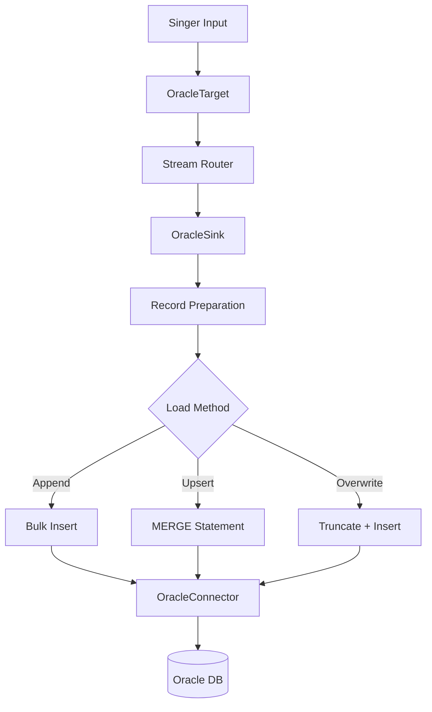

# Oracle Target Architecture Documentation

## Overview

The Oracle Target is a modern Singer SDK implementation that loads data into Oracle databases using SQLAlchemy 2.0. It follows SOLID principles and provides high-performance data loading with support for multiple load methods, parallel processing, and Oracle-specific optimizations.

## Architecture Principles

### SOLID Principles Applied

1. **Single Responsibility Principle (SRP)**
   - `OracleConnector`: Manages database connections and SQLAlchemy engine lifecycle
   - `OracleSink`: Handles data transformation and loading operations
   - `OracleTarget`: Orchestrates the overall target functionality

2. **Open/Closed Principle (OCP)**
   - Extensible through configuration without modifying core code
   - Plugin-based architecture for custom transformations
   - Event system for adding behavior without changing existing code

3. **Liskov Substitution Principle (LSP)**
   - Inherits from Singer SDK base classes maintaining all expected behaviors
   - Can be used anywhere a Singer target is expected

4. **Interface Segregation Principle (ISP)**
   - Clean interfaces between components
   - Connector provides only database operations
   - Sink focuses only on data processing

5. **Dependency Inversion Principle (DIP)**
   - Depends on Singer SDK abstractions
   - Uses SQLAlchemy abstractions rather than raw SQL

### Key Design Patterns

1. **Factory Pattern**: Pool class selection based on configuration
2. **Strategy Pattern**: Different load methods (append, upsert, overwrite)
3. **Observer Pattern**: SQLAlchemy event system for optimizations
4. **Template Method**: Base sink behavior extended with Oracle specifics

## Component Architecture

### OracleConnector

Responsible for all database connectivity using SQLAlchemy 2.0:

```python
class OracleConnector(SQLConnector):
    """Manages Oracle database connections with SQLAlchemy 2.0."""
    
    # Key responsibilities:
    # - Connection URL generation using URL.create()
    # - Connection pool management (QueuePool, NullPool, StaticPool)
    # - Type mapping between JSON Schema and Oracle types
    # - Event listeners for session optimization
    # - Health checking and monitoring
```

**Features:**
- Modern SQLAlchemy 2.0 patterns (URL.create(), future=True)
- Intelligent pool selection based on workload
- Column pattern recognition for optimal type mapping
- Event-based session optimization

### OracleSink

Handles data processing and loading:

```python
class OracleSink(SQLSink):
    """High-performance data sink for Oracle databases."""
    
    # Key responsibilities:
    # - Batch processing with configurable size
    # - Parallel loading for large datasets
    # - Multiple load methods (append, upsert, overwrite)
    # - Audit field management
    # - Transaction handling
```

**Features:**
- Bulk operations using SQLAlchemy's executemany()
- Oracle MERGE statements for upserts
- Parallel processing with ThreadPoolExecutor
- Automatic audit field injection

### OracleTarget

Main entry point and orchestrator:

```python
class OracleTarget(Target):
    """Singer target for Oracle databases."""
    
    # Key responsibilities:
    # - Configuration management
    # - Engine lifecycle (sync and async)
    # - Stream discovery
    # - Health monitoring
    # - Resource cleanup
```

## Data Flow



## Performance Optimizations

### Connection Pooling

Dynamic pool selection based on workload:
- `pool_size=0`: NullPool for serverless/lambda
- `pool_size=1`: StaticPool for single connection
- `pool_size>1`: QueuePool for concurrent operations

### Bulk Operations

- Uses SQLAlchemy's bulk insert features
- Oracle-specific hints (APPEND_VALUES) for direct path loading
- Configurable batch sizes for memory management

### Parallel Processing

- ThreadPoolExecutor for concurrent batch processing
- Configurable thread count
- Automatic chunking for optimal parallelism

### Type Optimizations

Intelligent column type mapping:
- `*_ID` columns → NUMBER(38,0)
- `*_FLG` columns → NUMBER(1,0) 
- `*_TS` columns → TIMESTAMP WITH TIME ZONE
- `*_AMOUNT` columns → NUMBER(19,4)

## Configuration

### Required Settings

```json
{
  "host": "oracle.example.com",
  "port": 1521,
  "user": "username",
  "password": "password",
  "service_name": "ORCL"
}
```

### Performance Tuning

```json
{
  "batch_size_rows": 10000,
  "parallel_threads": 8,
  "pool_size": 20,
  "pool_recycle": 3600,
  "use_direct_path": true,
  "enable_parallel_dml": true
}
```

### Advanced Options

```json
{
  "load_method": "upsert",
  "add_record_metadata": true,
  "enable_column_patterns": true,
  "default_target_schema": "ETL",
  "table_prefix": "SINGER_"
}
```

## Error Handling

### Retry Logic

- Automatic reconnection on connection loss
- Configurable retry attempts and backoff
- Transaction rollback on batch failures

### Logging

- Structured logging with performance metrics
- Debug mode for troubleshooting
- Progress tracking for long-running loads

## Security

### Connection Security

- Supports Oracle wallet for secure credentials
- SSL/TLS encryption support
- No hardcoded credentials in code

### Audit Trail

Automatic audit fields:
- `CREATE_USER`: User who created the record
- `CREATE_TS`: Creation timestamp
- `MOD_USER`: User who last modified
- `MOD_TS`: Last modification timestamp

## Extensibility

### Custom Type Mappings

Override type conversion methods:

```python
class CustomOracleConnector(OracleConnector):
    def to_sql_type(self, schema: dict) -> TypeEngine:
        # Custom type logic
        return super().to_sql_type(schema)
```

### Event Handlers

Add custom behavior using SQLAlchemy events:

```python
@event.listens_for(engine, "before_execute")
def add_query_hints(conn, clauseelement, multiparams, params, execution_options):
    # Add custom Oracle hints
    pass
```

## Testing

### Unit Tests

- Type conversion validation
- Pool selection logic
- Schema generation
- Error handling

### Integration Tests

- End-to-end data loading
- Performance benchmarks
- Concurrent operations
- Transaction handling

## Monitoring

### Health Checks

Built-in health monitoring:
- Database connectivity
- Pool statistics
- Performance metrics
- Error rates

### Metrics

Performance tracking:
- Records per second
- Batch processing time
- Connection pool utilization
- Memory usage

## Best Practices

1. **Batch Size**: Start with 10,000 and adjust based on memory
2. **Parallelism**: Use 2-4 threads per CPU core
3. **Pool Size**: Set to expected concurrent operations + buffer
4. **Load Method**: Use append-only for best performance
5. **Direct Path**: Enable for large bulk loads
6. **Audit Fields**: Keep enabled for data lineage