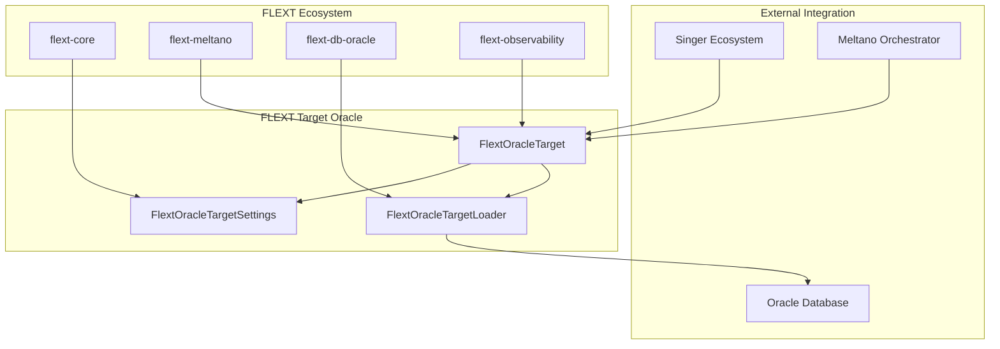

# FLEXT Target Oracle Documentation

<!-- TOC START -->

- [Quick Navigation](#quick-navigation)
  - [📚 **Core Documentation**](#core-documentation)
  - [🚀 **Getting Started**](#getting-started)
- [Document Overview](#document-overview)
  - \[[Architecture Guide](architecture.md)\](#architecture-guidearchitecturemd)
  - \[[Development Guide](development.md)\](#development-guidedevelopmentmd)
  - \[[Singer Integration](guides/singer-integration.md)\](#singer-integrationguidessinger-integrationmd)
  - \[[TODO & Issues](TODO.md)\](#todo-issuestodomd)
- [Project Status](#project-status)
  - [**Current Version**: 0.9.9 - Pre-production](#current-version-099-pre-production)
  - [**Production Readiness Checklist**](#production-readiness-checklist)
  - [**Critical Issues Summary**](#critical-issues-summary)
- [FLEXT Ecosystem Integration](#flext-ecosystem-integration)
  - [Position in FLEXT Architecture](#position-in-flext-architecture)
  - [Core Dependencies](#core-dependencies)
- [Documentation Standards](#documentation-standards)
  - [Writing Guidelines](#writing-guidelines)
  - [Maintenance](#maintenance)
- [Support and Feedback](#support-and-feedback)
  - [Getting Help](#getting-help)
  - [Contributing to Documentation](#contributing-to-documentation)
  - [Feedback Channels](#feedback-channels)

<!-- TOC END -->

**Complete technical documentation for the FLEXT Target Oracle Singer target.**

## Quick Navigation

### 📚 **Core Documentation**

| Document                                               | Purpose                                               | Audience                  |
| ------------------------------------------------------ | ----------------------------------------------------- | ------------------------- |
| **[Architecture Guide](architecture.md)**              | Detailed technical architecture and design patterns   | Developers, Architects    |
| **[Development Guide](development.md)**                | Development workflows, testing, and contributing      | Contributors, Maintainers |
| **[Singer Integration](guides/singer-integration.md)** | Singer SDK compliance and protocol implementation     | Integration Engineers     |
| **[TODO & Issues](TODO.md)**                           | Known issues, technical debt, and improvement roadmap | All Stakeholders          |

### 🚀 **Getting Started**

1. **New Developer Setup**: Start with [Development Guide](development.md#quick-start)
1. **Architecture Understanding**: Read [Architecture Guide](architecture.md#overview)
1. **Singer Integration**: Review [Singer Integration](guides/singer-integration.md#overview)
1. **Known Issues**: Check [TODO & Issues](TODO.md) for current status

## Document Overview

### [Architecture Guide](architecture.md)

> **Technical architecture, design patterns, and FLEXT ecosystem integration**

- **Clean Architecture Implementation**: Layered architecture with clear separation of concerns
- **FLEXT Pattern Integration**: FlextResult, m.Value, and logging patterns
- **Component Architecture**: Detailed component responsibilities and interactions
- **Data Flow Architecture**: Singer message processing and Oracle integration
- **Performance Architecture**: Batch processing, connection management, and optimization
- **Security Architecture**: Current measures and identified vulnerabilities
- **Testing Architecture**: Test structure and patterns
- **Integration Architecture**: FLEXT ecosystem and external system integration

### [Development Guide](development.md)

> **Comprehensive developer documentation for working with the codebase**

- **Quick Start**: Environment setup and verification
- **Development Workflow**: Daily development commands and best practices
- **FLEXT Pattern Implementation**: Practical examples of FLEXT patterns
- **Oracle Integration Development**: Database connectivity and testing
- **Debugging and Troubleshooting**: Common issues and solutions
- **Testing Development**: Writing tests and test patterns
- **Performance Development**: Optimization techniques and benchmarking
- **Contributing Guidelines**: Standards and pull request process

### [Singer Integration](guides/singer-integration.md)

> **Singer SDK compliance, protocol implementation, and integration patterns**

- **Singer Protocol Implementation**: SCHEMA, RECORD, and STATE message handling
- **Implementation Status**: Current compliance and missing features
- **Meltano Integration**: Configuration schema and execution patterns
- **Data Loading Patterns**: Table creation, record processing, and batch handling
- **Performance Optimization**: Batch size tuning and Oracle-specific optimizations
- **Error Handling and Reliability**: FlextResult patterns and transaction management
- **Testing Singer Integration**: Unit and integration testing approaches
- **Compliance Roadmap**: Version-based improvement plan

### [TODO & Issues](TODO.md)

> **Critical issues, technical debt, and improvement roadmap**

- **Critical Architectural Deviations**: Exception duplication, SQL injection risks
- **Implementation Problems**: Singer SDK compliance gaps, security vulnerabilities
- **Architecture Improvements**: Factory patterns, logging enhancements
- **Testing Issues**: Coverage gaps, integration test needs
- **Prioritized Action Plan**: 4-week improvement roadmap with clear deliverables

## Project Status

### **Current Version**: 0.9.9 - Pre-production

> ⚠️ **Important**: This target is currently undergoing architectural improvements to address identified critical issues.

### **Production Readiness Checklist**

- ❌ **Singer SDK Compliance**: Missing standard Singer Target methods
- ❌ **Security**: SQL injection vulnerabilities need addressing
- ✅ **FLEXT Integration**: Properly uses flext-core patterns
- ✅ **Testing**: 90%+ test coverage maintained
- ❌ **Documentation**: Architecture docs need completion
- ❌ **Performance**: Transaction batching needs optimization

### **Critical Issues Summary**

| Issue                      | Priority | Impact                  | Target Release |
| -------------------------- | -------- | ----------------------- | -------------- |
| Exception duplication      | High     | Code maintainability    | v1.0.0         |
| SQL injection risk         | High     | Security vulnerability  | v1.0.0         |
| Missing Singer SDK methods | High     | Ecosystem compatibility | v1.0.0         |
| Transaction management     | Medium   | Data reliability        | v1.1.0         |

## FLEXT Ecosystem Integration

### Position in FLEXT Architecture

### Core Dependencies

- **[flext-core](https://github.com/organization/flext/tree/main/flext-core/)**: Foundational patterns (FlextResult, m.Value, logging)
- **[flext-meltano](https://github.com/organization/flext/tree/main/flext-meltano/)**: Singer SDK integration and Target base classes
- **[flext-db-oracle](https://github.com/organization/flext/tree/main/flext-db-oracle/)**: Oracle database operations and connectivity
- **[flext-observability](https://github.com/organization/flext/tree/main/flext-observability/)**: Monitoring and metrics (planned integration)

## Documentation Standards

### Writing Guidelines

1. **FLEXT Patterns First**: Always reference FLEXT ecosystem patterns and integration
1. **Code Examples**: Include working, testable code examples
1. **Architecture Focus**: Emphasize Clean Architecture and DDD principles
1. **Security Awareness**: Highlight security considerations and current issues
1. **Production Readiness**: Be clear about production readiness status

### Maintenance

- **Review Frequency**: Documentation reviewed with each release
- **Update Triggers**: Code changes, architecture decisions, pattern evolution
- **Version Alignment**: Documentation version matches code version
- **Cross-References**: Maintain links between related documents

## Support and Feedback

### Getting Help

1. **Technical Issues**: Check [Development Guide](development.md#debugging-and-troubleshooting)
1. **Architecture Questions**: Review [Architecture Guide](architecture.md)
1. **Singer Integration**: See [Singer Integration](guides/singer-integration.md)
1. **Known Issues**: Consult [TODO & Issues](TODO.md)

### Contributing to Documentation

1. **Follow FLEXT Standards**: Use established FLEXT documentation patterns
1. **Test Examples**: Ensure all code examples are tested and functional
1. **Architecture Alignment**: Maintain consistency with FLEXT ecosystem documentation
1. **Security Awareness**: Document security considerations and current issues

### Feedback Channels

- **Documentation Issues**: GitHub Issues with `documentation` label
- **Architecture Feedback**: GitHub Discussions in `architecture` category
- **Security Issues**: Private report to <security@flext.sh>
- **General Questions**: GitHub Discussions in `general` category

______________________________________________________________________

**Documentation Version**: 1.0\
**Last Updated**: 2025-08-04\
**Maintained By**: [FLEXT Team](https://github.com/flext-sh)\
**Next Review**: 2025-08-11
