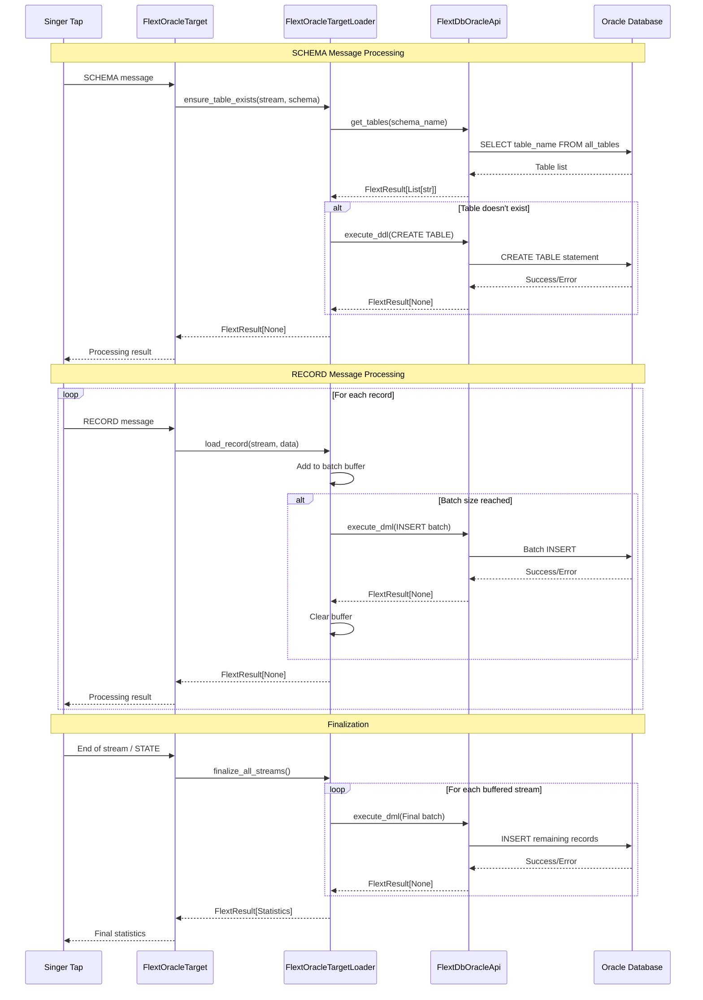
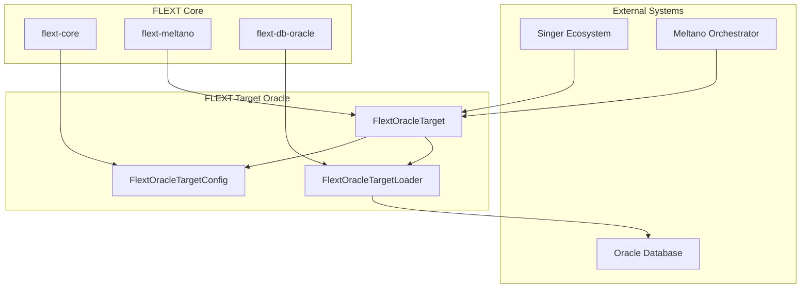

# Architecture Guide

**FLEXT Target Oracle - Technical Architecture Documentation**

## Overview

FLEXT Target Oracle implements a layered architecture following Clean Architecture principles, integrated with FLEXT ecosystem patterns and Singer specification compliance. This document provides detailed architectural guidance for developers working with the target.

## Architecture Principles

### FLEXT Core Integration

The target is built on foundational FLEXT patterns:

```python
# FlextResult Railway Pattern - Consistent error handling
from flext_core import FlextResult, FlextValue, get_logger

# Configuration with domain validation
class FlextOracleTargetConfig(FlextValue):
    def validate_domain_rules(self) -> FlextResult[None]:
        # Chain of Responsibility validation pattern
```

### Clean Architecture Layers

```
┌─────────────────────────────────────────────────┐
│                 Presentation Layer              │
│   ┌─────────────────────────────────────────┐   │
│   │           Singer Messages              │   │
│   │      (SCHEMA, RECORD, STATE)           │   │
│   └─────────────────────────────────────────┘   │
└─────────────────────────────────────────────────┘
                        │
                        ▼
┌─────────────────────────────────────────────────┐
│              Application Layer                  │
│   ┌─────────────────────────────────────────┐   │
│   │      FlextOracleTarget                 │   │
│   │   • process_singer_message()           │   │
│   │   • _handle_schema()                   │   │
│   │   • _handle_record()                   │   │
│   │   • _handle_state()                    │   │
│   └─────────────────────────────────────────┘   │
└─────────────────────────────────────────────────┘
                        │
                        ▼
┌─────────────────────────────────────────────────┐
│               Domain Layer                      │
│   ┌─────────────────────────────────────────┐   │
│   │     FlextOracleTargetConfig            │   │
│   │   • Configuration validation           │   │
│   │   • Business rules                     │   │
│   │   • Domain entities                    │   │
│   └─────────────────────────────────────────┘   │
└─────────────────────────────────────────────────┘
                        │
                        ▼
┌─────────────────────────────────────────────────┐
│             Infrastructure Layer                │
│   ┌─────────────────────────────────────────┐   │
│   │    FlextOracleTargetLoader             │   │
│   │   • Oracle connectivity                │   │
│   │   • Batch processing                   │   │
│   │   • Table management                   │   │
│   └─────────────────────────────────────────┘   │
│   ┌─────────────────────────────────────────┐   │
│   │      flext-db-oracle                   │   │
│   │   • FlextDbOracleApi                   │   │
│   │   • Connection management              │   │
│   │   • SQL execution                      │   │
│   └─────────────────────────────────────────┘   │
└─────────────────────────────────────────────────┘
```

## Component Architecture

### 1. FlextOracleTarget (Application Layer)

**Responsibility**: Singer protocol implementation and message orchestration

```python
class FlextOracleTarget(Target):
    """Singer Target implementation with FLEXT patterns."""

    # Singer protocol compliance
    async def process_singer_message(self, message: dict) -> FlextResult[None]
    async def _handle_schema(self, message: dict) -> FlextResult[None]
    async def _handle_record(self, message: dict) -> FlextResult[None]
    async def _handle_state(self, message: dict) -> FlextResult[None]

    # Lifecycle management
    async def finalize(self) -> FlextResult[dict[str, object]]
```

**Key Patterns**:

- **FlextResult Railway Pattern**: All operations return `FlextResult<T>`
- **Message Type Routing**: Dispatch based on Singer message type
- **Dependency Injection**: Uses `FlextOracleTargetLoader` for data operations

### 2. FlextOracleTargetConfig (Domain Layer)

**Responsibility**: Configuration management with domain validation

```python
class FlextOracleTargetConfig(FlextValue):
    """Type-safe configuration with business rule validation."""

    # Required Oracle connection parameters
    oracle_host: str
    oracle_port: int = 1521
    oracle_service: str
    oracle_user: str
    oracle_password: str

    # Business configuration
    default_target_schema: str = "target"
    load_method: LoadMethod = LoadMethod.INSERT
    batch_size: int = 1000
    use_bulk_operations: bool = True
    connection_timeout: int = 30

    def validate_domain_rules(self) -> FlextResult[None]:
        """Chain of Responsibility validation pattern."""
```

**Key Patterns**:

- **Value Object Pattern**: Immutable, validated configuration
- **Chain of Responsibility**: Modular validation rules
- **Builder Pattern**: Configuration conversion for flext-db-oracle

### 3. FlextOracleTargetLoader (Infrastructure Layer)

**Responsibility**: Oracle-specific data loading operations

```python
class FlextOracleTargetLoader:
    """Oracle data loading with batch processing."""

    def __init__(self, config: FlextOracleTargetConfig):
        # flext-db-oracle integration
        self.oracle_api = FlextDbOracleApi(oracle_config)
        self._record_buffers: dict[str, list[dict]] = {}

    # Table management
    async def ensure_table_exists(self, stream_name: str, schema: dict) -> FlextResult[None]

    # Data loading with batching
    async def load_record(self, stream_name: str, record_data: dict) -> FlextResult[None]
    async def finalize_all_streams(self) -> FlextResult[dict[str, object]]
```

**Key Patterns**:

- **Batch Processing**: Configurable batch sizes for performance
- **Context Manager**: Safe resource management with `with` statements
- **Template Method**: Consistent error handling and logging

## Data Flow Architecture

### Singer Message Processing Flow



### Error Handling Flow

```mermaid
flowchart TD
    A[Operation Start] --> B{FlextResult Pattern}
    B -->|Success| C[Continue Pipeline]
    B -->|Failure| D[Log Error with Context]
    D --> E[Return FlextResult[None].fail()]
    E --> F[Caller Handles Error]
    F --> G{Recoverable?}
    G -->|Yes| H[Retry with Backoff]
    G -->|No| I[Propagate to Singer]
    H --> B
    I --> J[Singer Error Handling]
    C --> K[Operation Complete]
```

## Performance Architecture

### Batch Processing Strategy

```python
class BatchProcessor:
    """Configurable batch processing for optimal performance."""

    def __init__(self, batch_size: int = 1000):
        self._buffers: dict[str, list[Record]] = {}
        self._batch_size = batch_size

    async def add_record(self, stream: str, record: dict) -> FlextResult[None]:
        # Add to buffer
        buffer = self._buffers.setdefault(stream, [])
        buffer.append(record)

        # Flush if batch size reached
        if len(buffer) >= self._batch_size:
            return await self._flush_batch(stream)

        return FlextResult[None].ok(None)
```

### Connection Management

```python
# Context manager pattern ensures resource cleanup
with self.oracle_api as connected_api:
    # All operations within connection context
    result = connected_api.execute_dml(sql, params)
    # Connection automatically closed
```

### Memory Management

- **Streaming Processing**: Records processed one at a time, not loaded into memory
- **Batch Buffering**: Configurable batch sizes to balance memory vs. performance
- **Connection Pooling**: Via flext-db-oracle connection pool management

## Security Architecture

### Current Security Measures

1. **Configuration Validation**: Input validation via Pydantic models
2. **Connection Security**: SSL support via flext-db-oracle
3. **Credential Management**: SecretStr for password handling

### Security Issues (TO BE ADDRESSED)

> ⚠️ **Critical Security Issue**: SQL injection vulnerability in manual SQL construction

**Current Problematic Code**:

```python
# SECURITY RISK - Manual string replacement
parameterized_sql = sql.replace(":data", f"'{param['data']}'")
result = connected_api.execute_ddl(parameterized_sql)
```

**Required Fix**:

```python
# SECURE - Use proper parameterized queries
result = connected_api.execute_dml(sql, param)
```

## Testing Architecture

### Test Structure

```
tests/
├── unit/                    # Fast, isolated tests
│   ├── test_config.py      # Configuration validation
│   ├── test_target.py      # Target message handling
│   └── test_loader.py      # Loader batch processing
├── integration/            # Oracle database integration
│   ├── test_oracle_connection.py
│   └── test_end_to_end.py
├── performance/            # Performance benchmarks
│   └── test_batch_performance.py
└── security/               # Security validation
    └── test_sql_injection.py
```

### Test Patterns

```python
# FlextResult testing pattern
def test_operation_success():
    result = operation()
    assert result.success
    assert result.data == expected_value

def test_operation_failure():
    result = operation_with_error()
    assert result.is_failure
    assert "expected error" in result.error
```

## Integration Architecture

### FLEXT Ecosystem Integration



### Configuration Integration

```python
# flext-core patterns
config = FlextOracleTargetConfig(...)
validation_result = config.validate_domain_rules()

# flext-db-oracle integration
oracle_config = config.get_oracle_config()
api = FlextDbOracleApi(oracle_config)

# flext-meltano integration
target = FlextOracleTarget(config)
```

## Deployment Architecture

### Production Deployment Patterns

```yaml
# Docker Compose example
version: "3.8"
services:
  flext-target-oracle:
    image: flext/target-oracle:latest
    environment:
      - ORACLE_HOST=prod-oracle.company.com
      - ORACLE_SERVICE=PRODDB
      - ORACLE_USER=flext_user
      - ORACLE_PASSWORD_FILE=/run/secrets/oracle_password
      - BATCH_SIZE=5000
      - CONNECTION_TIMEOUT=60
    secrets:
      - oracle_password
    networks:
      - flext-network
      - oracle-network

secrets:
  oracle_password:
    external: true

networks:
  flext-network:
    external: true
  oracle-network:
    external: true
```

### Monitoring and Observability

```python
# Structured logging with correlation IDs
logger = get_logger(__name__)
logger.info("Batch processing started", extra={
    "stream_name": stream_name,
    "batch_size": len(records),
    "correlation_id": correlation_id
})

# Metrics integration
metrics.counter("oracle_target.records_processed").inc(count)
metrics.histogram("oracle_target.batch_duration").observe(duration)
```

## Future Architecture Considerations

### Planned Improvements

1. **Singer SDK Compliance**: Implement missing Singer Target methods
2. **Security Hardening**: Fix SQL injection vulnerabilities
3. **Schema Evolution**: Dynamic schema modification support
4. **Performance Optimization**: Advanced Oracle features (partitioning, compression)
5. **Observability Enhancement**: Distributed tracing integration

### Scalability Considerations

- **Horizontal Scaling**: Multiple target instances with stream partitioning
- **Vertical Scaling**: Increased batch sizes and connection pools
- **Oracle Optimization**: Bulk operations, parallel processing, compression

---

**Document Version**: 1.0  
**Last Updated**: 2025-08-04  
**Next Review**: 2025-08-11
