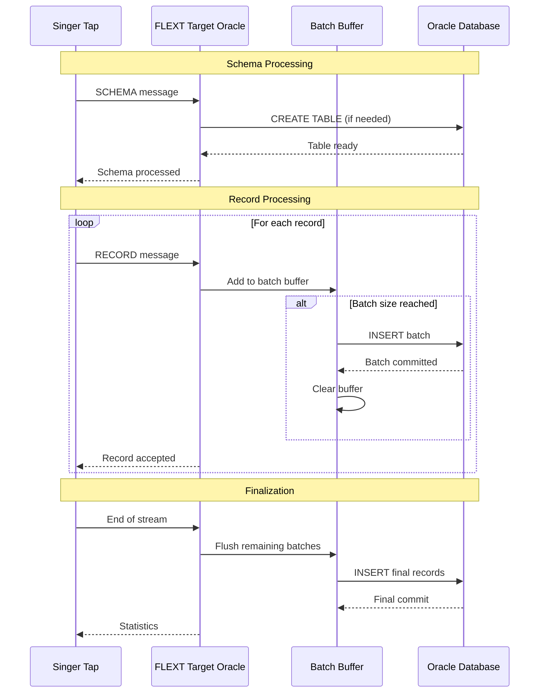

# Singer SDK Integration Guide

**FLEXT Target Oracle - Singer Protocol Compliance Documentation**

## Overview

FLEXT Target Oracle implements the Singer specification for data integration, providing standardized data loading capabilities for Oracle databases. This document details the Singer protocol implementation, compliance status, and integration patterns.

## Singer Protocol Implementation

### Message Types Supported

#### SCHEMA Messages
```json
{
  "type": "SCHEMA",
  "stream": "users",
  "schema": {
    "type": "object",
    "properties": {
      "id": {"type": "integer"},
      "name": {"type": "string"},
      "email": {"type": "string", "format": "email"}
    }
  },
  "key_properties": ["id"]
}
```

**Implementation**:
```python
async def _handle_schema(self, message: dict[str, object]) -> FlextResult[None]:
    """Handle SCHEMA message with table creation/evolution."""
    stream_name = message.get("stream")
    schema = message.get("schema", {})
    
    # Ensure target table exists
    result = await self._loader.ensure_table_exists(stream_name, schema)
    if result.is_success:
        logger.info(f"Schema processed for stream: {stream_name}")
    
    return result
```

#### RECORD Messages
```json
{
  "type": "RECORD",
  "stream": "users", 
  "record": {
    "id": 1,
    "name": "John Doe",
    "email": "john@example.com"
  },
  "time_extracted": "2025-08-04T10:00:00.000000Z"
}
```

**Implementation**:
```python
async def _handle_record(self, message: dict[str, object]) -> FlextResult[None]:
    """Handle RECORD message with batched loading."""
    stream_name = message.get("stream")
    record_data = message.get("record")
    
    if not isinstance(stream_name, str) or not isinstance(record_data, dict):
        return FlextResult.fail("Record message missing stream or data")
    
    return await self._loader.load_record(stream_name, record_data)
```

#### STATE Messages
```json
{
  "type": "STATE",
  "value": {
    "bookmarks": {
      "users": {
        "last_updated": "2025-08-04T10:00:00.000000Z"
      }
    }
  }
}
```

**Implementation**:
```python
async def _handle_state(self, message: dict[str, object]) -> FlextResult[None]:
    """Handle STATE message - forwarded to orchestrator."""
    # State messages are typically handled by Meltano/orchestrator
    logger.debug("State message received - forwarding to Meltano")
    return FlextResult.ok(None)
```

## Current Implementation Status

### ✅ Implemented Features

| Feature | Status | Implementation |
|---------|--------|----------------|
| SCHEMA message handling | ✅ Complete | `_handle_schema()` |
| RECORD message handling | ✅ Complete | `_handle_record()` |
| STATE message handling | ✅ Complete | `_handle_state()` |
| Batch processing | ✅ Complete | Configurable batch sizes |
| Error handling | ✅ Complete | FlextResult pattern |
| JSON storage | ✅ Complete | CLOB-based flexible storage |
| Configuration validation | ✅ Complete | Pydantic + domain rules |

### ❌ Missing Singer SDK Compliance

> ⚠️ **Critical Issue**: Missing standard Singer Target methods required for full SDK compliance

| Missing Method | Priority | Singer SDK Requirement |
|----------------|----------|----------------------|
| `_test_connection()` | High | Connection testing interface |
| `_write_record()` | High | Standard record writing method |
| `_write_records()` | High | Batch record writing method |
| `.config_class` property | Medium | Configuration class reference |
| `.name` property | Medium | Target name identifier |

**Current Non-Standard Implementation**:
```python
# ❌ Custom method - not Singer SDK compliant
async def process_singer_message(self, message: dict) -> FlextResult[None]:
    # Custom message processing
```

**Required Singer SDK Methods**:
```python
# ✅ Standard Singer SDK interface
class FlextOracleTarget(Target):
    name = "target-oracle"
    config_class = FlextOracleTargetConfig
    
    def _test_connection(self) -> bool:
        """Test connection - Singer SDK requirement."""
        return self._test_connection_impl()
    
    def _write_record(self, record: Record) -> None:
        """Write single record - Singer SDK requirement."""
        # Convert Record to dict and process
    
    def _write_records(self, records: List[Record]) -> None:
        """Write batch of records - Singer SDK requirement."""
        # Batch processing implementation
```

## Meltano Integration

### Configuration Schema

```yaml
# meltano.yml target definition
targets:
  - name: target-oracle
    namespace: flext_target_oracle
    pip_url: flext-target-oracle
    settings:
      # Connection settings
      - name: oracle_host
        label: Oracle Host
        kind: string
        description: Oracle database host
      - name: oracle_port
        label: Oracle Port  
        kind: integer
        default: 1521
        description: Oracle database port
      - name: oracle_service
        label: Oracle Service
        kind: string
        description: Oracle service name
      - name: oracle_user
        label: Oracle User
        kind: string
        description: Oracle username
      - name: oracle_password
        label: Oracle Password
        kind: password
        secret: true
        description: Oracle password
      - name: default_target_schema
        label: Target Schema
        kind: string
        default: "MELTANO_DATA"
        description: Target schema for tables
      
      # Performance settings
      - name: batch_size
        label: Batch Size
        kind: integer
        default: 1000
        description: Records per batch
      - name: load_method
        label: Load Method
        kind: options
        options:
          - label: INSERT
            value: INSERT
          - label: MERGE
            value: MERGE
          - label: BULK_INSERT
            value: BULK_INSERT
          - label: BULK_MERGE
            value: BULK_MERGE
        default: INSERT
        description: Data loading strategy
      - name: use_bulk_operations
        label: Use Bulk Operations
        kind: boolean
        default: true
        description: Enable Oracle bulk operations
      - name: connection_timeout
        label: Connection Timeout
        kind: integer
        default: 30
        description: Connection timeout in seconds
```

### Meltano Execution

```bash
# Add target to Meltano project
meltano add target target-oracle

# Configure target
meltano config target-oracle set oracle_host localhost
meltano config target-oracle set oracle_service XE
meltano config target-oracle set oracle_user meltano_user
meltano config target-oracle set oracle_password secret_password

# Test connection
meltano invoke target-oracle --about
meltano invoke target-oracle --test

# Run ELT pipeline
meltano run tap-csv target-oracle
```

## Data Loading Patterns

### Table Creation Strategy

FLEXT Target Oracle uses a simplified JSON storage approach for flexibility:

```sql
-- Generated table structure
CREATE TABLE "SCHEMA"."STREAM_NAME" (
    "DATA" CLOB,                              -- JSON record data
    "_SDC_EXTRACTED_AT" TIMESTAMP,            -- Singer extraction timestamp
    "_SDC_BATCHED_AT" TIMESTAMP DEFAULT CURRENT_TIMESTAMP,  -- Batch processing time
    "_SDC_SEQUENCE" NUMBER DEFAULT 0          -- Record sequence number
)
```

**Benefits**:
- **Schema Flexibility**: No need for complex schema evolution
- **Fast Implementation**: Minimal DDL operations
- **JSON Querying**: Oracle JSON functions for data access

**Trade-offs**:
- **Storage Efficiency**: Less optimal than normalized tables
- **Query Performance**: May require JSON extraction for complex queries
- **Indexing Limitations**: Limited indexing options on JSON data

### Record Processing Flow



### Batch Processing Configuration

```python
# Configure batch processing for optimal performance
config = FlextOracleTargetConfig(
    # ... connection config
    batch_size=1000,           # Records per batch
    use_bulk_operations=True,  # Enable Oracle bulk operations
    connection_timeout=60      # Connection timeout in seconds
)

# Batch processing automatically handles:
# - Buffer management per stream
# - Automatic flushing when batch size reached
# - Final flush on stream completion
# - Error handling and rollback
```

## Performance Optimization

### Batch Size Tuning

| Batch Size | Use Case | Performance | Memory Usage |
|------------|----------|-------------|--------------|
| 100-500 | Small datasets, low memory | Good | Low |
| 1000-2000 | Standard workloads | Optimal | Medium |
| 5000-10000 | Large datasets, bulk loading | Best | High |

```python
# Performance testing different batch sizes
import time

async def benchmark_batch_performance():
    """Benchmark different batch sizes."""
    batch_sizes = [500, 1000, 2000, 5000]
    results = {}
    
    for batch_size in batch_sizes:
        config = FlextOracleTargetConfig(batch_size=batch_size)
        target = FlextOracleTarget(config)
        
        start_time = time.time()
        
        # Process test dataset
        await process_test_data(target)
        
        duration = time.time() - start_time
        results[batch_size] = duration
    
    return results
```

### Oracle-Specific Optimizations

```python
# Oracle performance configuration
config = FlextOracleTargetConfig(
    # Connection optimization
    connection_timeout=60,
    
    # Batch optimization  
    batch_size=2000,
    use_bulk_operations=True,
    
    # Load method optimization
    load_method=LoadMethod.BULK_INSERT  # Fastest for append-only
)

# Additional Oracle features (future implementation)
# - Parallel processing
# - Compression
# - Partitioning
# - Direct path loading
```

## Error Handling and Reliability

### FlextResult Error Patterns

```python
# Consistent error handling with FlextResult
async def process_with_error_handling():
    """Example of proper error handling in Singer context."""
    
    # Schema processing
    schema_result = await target.process_singer_message(schema_msg)
    if schema_result.is_failure:
        logger.error(f"Schema processing failed: {schema_result.error}")
        # Singer protocol: continue processing or abort based on error type
        return schema_result
    
    # Record processing with retry logic
    for record_msg in record_messages:
        result = await target.process_singer_message(record_msg)
        if result.is_failure:
            # Decide on retry strategy
            if is_transient_error(result.error):
                result = await retry_with_backoff(target.process_singer_message, record_msg)
            
            if result.is_failure:
                logger.error(f"Record processing failed: {result.error}")
                # Singer protocol: may skip record or abort entire stream
    
    # Finalization
    final_result = await target.finalize()
    return final_result
```

### Transaction Management

```python
# Current implementation (needs improvement)
async def _insert_batch(self, table_name: str, records: list) -> FlextResult[None]:
    """Insert batch with basic error handling."""
    try:
        with self.oracle_api as connected_api:
            # Each record inserted individually (not optimal)
            for record in records:
                result = connected_api.execute_ddl(sql)  # Should be execute_dml
                if not result.is_success:
                    return FlextResult.fail(f"Insert failed: {result.error}")
        
        return FlextResult.ok(None)
    
    except Exception as e:
        return FlextResult.fail(f"Batch insert failed: {e}")

# Improved implementation (needed)
async def _insert_batch_improved(self, table_name: str, records: list) -> FlextResult[None]:
    """Insert batch with proper transaction management."""
    try:
        with self.oracle_api as connected_api:
            with connected_api.begin_transaction():  # Explicit transaction
                # True batch insert operation
                result = connected_api.execute_batch_dml(sql, parameters)
                if result.is_failure:
                    # Transaction automatically rolled back
                    return FlextResult.fail(f"Batch insert failed: {result.error}")
                
                # Commit only on success
                connected_api.commit()
        
        return FlextResult.ok(None)
    
    except Exception as e:
        # Transaction automatically rolled back
        return FlextResult.fail(f"Batch insert failed: {e}")
```

## Testing Singer Integration

### Unit Testing Singer Messages

```python
import pytest
from flext_target_oracle import FlextOracleTarget

class TestSingerIntegration:
    """Test Singer protocol compliance."""
    
    @pytest.fixture
    def target(self, sample_config):
        return FlextOracleTarget(sample_config)
    
    async def test_schema_message_processing(self, target):
        """Test SCHEMA message handling."""
        schema_msg = {
            "type": "SCHEMA",
            "stream": "test_stream",
            "schema": {
                "type": "object",
                "properties": {"id": {"type": "integer"}}
            }
        }
        
        result = await target.process_singer_message(schema_msg)
        assert result.is_success
    
    async def test_record_message_processing(self, target):
        """Test RECORD message handling."""
        record_msg = {
            "type": "RECORD",
            "stream": "test_stream",
            "record": {"id": 1, "name": "Test"}
        }
        
        result = await target.process_singer_message(record_msg)
        assert result.is_success
    
    async def test_state_message_processing(self, target):
        """Test STATE message handling."""
        state_msg = {
            "type": "STATE",
            "value": {"bookmarks": {"test_stream": {"last_id": 100}}}
        }
        
        result = await target.process_singer_message(state_msg)
        assert result.is_success
    
    async def test_invalid_message_handling(self, target):
        """Test invalid message handling."""
        invalid_msg = {"type": "INVALID"}
        
        result = await target.process_singer_message(invalid_msg)
        assert result.is_failure
        assert "Unknown message type" in result.error
```

### Integration Testing with Singer Ecosystem

```python
# Test with actual Singer tap output
import subprocess
import json

async def test_singer_tap_integration():
    """Test integration with actual Singer tap."""
    
    # Run Singer tap to generate messages
    tap_process = subprocess.Popen(
        ["tap-csv", "--config", "tap_config.json"],
        stdout=subprocess.PIPE,
        text=True
    )
    
    target = FlextOracleTarget(config)
    
    # Process each Singer message
    for line in tap_process.stdout:
        try:
            message = json.loads(line.strip())
            result = await target.process_singer_message(message)
            
            if result.is_failure:
                print(f"Message processing failed: {result.error}")
                break
                
        except json.JSONDecodeError:
            # Skip non-JSON lines (logs, etc.)
            continue
    
    # Finalize processing
    final_result = await target.finalize()
    assert final_result.is_success
    
    tap_process.wait()
```

## Compliance Roadmap

### Version 1.0.0 Requirements

- [ ] **Implement missing Singer SDK methods**
  - [ ] `_test_connection()`
  - [ ] `_write_record()`
  - [ ] `_write_records()`
- [ ] **Fix SQL injection vulnerabilities**
- [ ] **Add direct Singer SDK dependency**
- [ ] **Complete transaction management**
- [ ] **Add schema evolution support**

### Version 1.1.0 Enhancements

- [ ] **Performance optimizations**
  - [ ] True Oracle bulk operations
  - [ ] Parallel processing
  - [ ] Connection pooling optimization
- [ ] **Advanced Oracle features**
  - [ ] Compression support
  - [ ] Partitioning support
  - [ ] Direct path loading

### Version 1.2.0 Advanced Features

- [ ] **Schema evolution**
  - [ ] ALTER TABLE operations
  - [ ] Column mapping and transformation
  - [ ] Data type evolution
- [ ] **Advanced error handling**
  - [ ] Dead letter queues
  - [ ] Retry policies
  - [ ] Circuit breaker patterns

---

**Document Version**: 1.0  
**Last Updated**: 2025-08-04  
**Singer Specification**: [hub.meltano.com/singer/spec](https://hub.meltano.com/singer/spec)  
**Next Review**: 2025-08-11